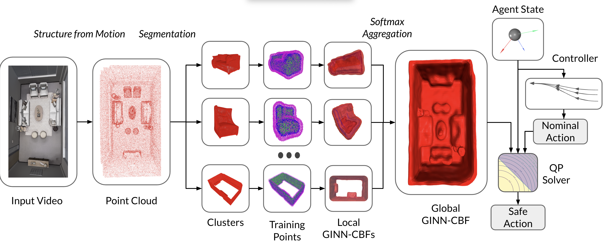
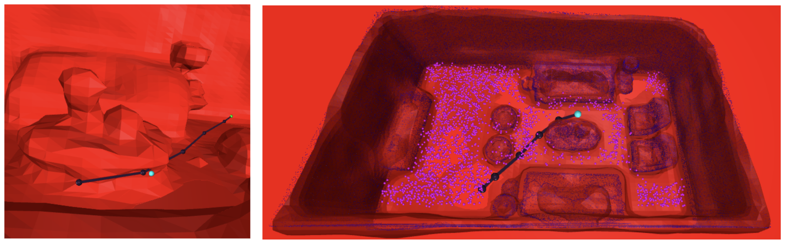
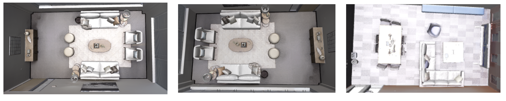

# GINN-CBF

## Table of Contents

- [ Description](#Description)
- [ GINN-CBF training](#Training)
- [Experiments](#features)

## Description

Ensuring safe autonomous navigation in 3D environments reconstructed from vision remains a core challenge, especially when relying on learned scene geometry. We propose GINN-CBF, a method that integrates Geometry-Informed Neural Networks (GINNs) with Control Barrier Functions (CBFs) to enforce safety in real-time over signed distance fields (SDFs). Each GINN is a sine-activated implicit network trained on object-level point cloud clusters with a novel forward-invariance loss, allowing SDFs to directly encode control-theoretic safety. This enables fast, safe control without the need for online retraining, even as objects in the scene move dynamically.


The GINN-CBF pipeline works by first processing an input video to create a 3D point cloud of the scene. This point cloud is then segmented into object-level clusters, and a separate GINN is trained for each cluster. These individual SDFs are then combined into a single global field using a differentiable masking strategy. At inference time, any nominal controller can be wrapped in a robust CBF-QP filter.


_(Right) PRM-based global planning in a cluttered scene. Candidate roadmap points (magenta) are sampled at the start, and six waypoints (black) are selected without re-sampling. The agent (cyan) is instructed to pass through an obstacle, but the CBF safely avoids the collision in real time. (Left) The cleaned up pathway_

This QP uses a Lipschitz-based bound to account for neural approximation error, guaranteeing robust safety and enabling collision avoidance in dynamic, cluttered environments.


_Test environment from Replica Dataset_

We evaluated our approach on visually reconstructed indoor scenes from the Replica Dataset under static and dynamic conditions. GINN-CBF achieved perfect safety and significantly higher goal success rates compared to baselines like DepthCBF, NeRF-CBF, and SaferSplat. Our method supports both reactive and global PRM-based planning and operates in real-time at 60Hz. This demonstrates that combining modular geometric learning with control-theoretic supervision is an effective way to achieve scalable and reactive safe planning in realistic environments

[The full report can be found here.](https://drive.google.com/file/d/1z2jh_ZfeRbUsmyq1YATlZmULjeibjlVN/view?usp=drive_link)

## Training

Runs the modified `ginn` training code, with my CBF changes. Graphs to a WandDB terminal. Example usage:

#### GINN-CBF training

```bash
python run.py \
  --gpu_list 0 \
  --yml config_3dis.yml \
  --no_save True \
  --hp_dict "lambda_bound:0;interface_delta:0;dataset_dir:/scratch/rhm4nj/cral/cral-ginn/ginn/myvis/data_gen/S3D/Area_1/0_ceiling;model_save_path:/scratch/rhm4nj/cral/cral-ginn/ginn/all_runs/models/experiments/2025-02-21_08-51-11_Area_1/_0_ceiling;lambda_descent:0.0001"
```

| Argument     | Description                                                                                                                                                                                                                                                                                                                                                                                              |
| ------------ | -------------------------------------------------------------------------------------------------------------------------------------------------------------------------------------------------------------------------------------------------------------------------------------------------------------------------------------------------------------------------------------------------------- |
| `--gpu_list` | Comma-separated list of GPU IDs to use (e.g. `0` for GPU 0).                                                                                                                                                                                                                                                                                                                                             |
| `--yml`      | Path to the YAML config file defining dataset paths, model settings, and other defaults.                                                                                                                                                                                                                                                                                                                 |
| `--no_save`  | Skip saving outputs when set to `True`                                                                                                                                                                                                                                                                                                                                                                   |
| `--hp_dict`  | Semicolon-delimited `key:value` pairs to override default hyperparameters:<br>- `interface_delta`: target value at surface (interface) of object (here `0`)<br>- `dataset_dir`: full path to the data directory used for training<br>- `model_save_path`: directory where model checkpoints and logs are written<br>- `lambda_descent`: weighting for forwared-invariance (descent) loss (here `0.0001`) |

#### Running in batches

To run mutiple scripts at once, `/scratch/rhm4nj/cral/cral-ginn-copy/slurm_scripts/schedule_ginn.ipynb` - runs individual `run.py` calls over several SLURM nodes, allowing for different hyper-paramters

## Experiments

To run an `GINN-CBF`, run `experiment_base.ipynb`. Includes visualizations at beginning and end of files for point cloud and results. To run multiple concurrent experiments, run `experiments_export.ipynb` which runs experiments across SLURM nodes.

## Full Setup

### Installation

```bash
# on Rivanna
ml cuda/12.4.1 gcc

conda env create -f environment.yml
conda activate ginn_env

# neural-cbf dependencies
cd ginn/neural_cbf
pip install -r requirements.in

# pointnext dependencies (if running segmentation from scratch / better segmentation)
cd ginn/pointnext
source update.sh
source install.sh

```

download Replica Dataset from: https://huggingface.co/datasets/kxic/vMAP/tree/main
unzip vmap.zip

### Train GINN (can skip if using my pre-trained model and pre-processed weights)

cd ginn/pointnext
Run `/scratch/rhm4nj/cral/cral-ginn/ginn/pointnext/examples/segmentation/test_replica.ipynb` - this is a notebook

- Change `data_root` to where you have the replica dataset saved
- Change `out_path` to where you want to save the augmented points

#### If access to SLURM:

Run the `schedule_ginn.ipynb` notebook.

#### Without SLURM access:

Run the `run.py` script for each GINN:

```bash
python run.py \
  --gpu_list 0 \
  --yml config_3dis.yml \
  --no_save True \
  --hp_dict "dataset_dir:/scratch/rhm4nj/cral/cral-ginn/ginn/myvis/data_gen/S3D/Area_1/0_ceiling;model_save_path:/scratch/rhm4nj/cral/cral-ginn/ginn/all_runs/models/experiments/2025-02-21_08-51-11_Area_1/_0_ceiling"
```

Replace `dataset_dir` with where the true points are truly located - set `model_save_path` to where you want to save the points.

#### Pre-trained

Alternatively, download the augmented points and weights from: https://drive.google.com/drive/folders/1imV61RNN8XDc9OjCdJ6tYh-ixRt2EoKn

Put the weights folder in `/scratch/rhm4nj/cral/cral-ginn/ginn/all_runs/models/experiments/2025-04-30_11-11-10_room_0_objects_final`
Put the points folder in `/scratch/rhm4nj/cral/cral-ginn/ginn/myvis/data_gen/replica/room_0_objects`

### Run Experiments

To run a single experiment, run `/scratch/rhm4nj/cral/display-cral-ginn/ginn/experiments_base.ipynb`

To run batched experiments, (requires SLURM) run `/scratch/rhm4nj/cral/display-cral-ginn/ginn/experiments_export.ipynb`.

Be sure to configure the paths for the augmented points and model weights for both.
